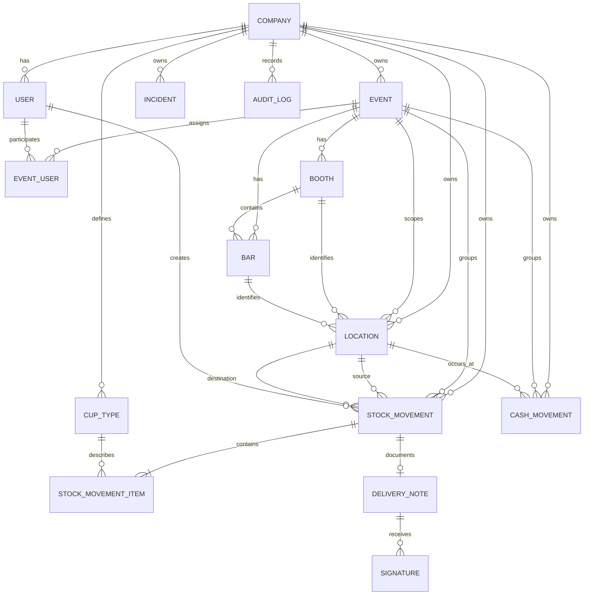

# Modelo de dominio — Fase 2

## Decisiones principales

- Todas las entidades usan `String @default(cuid())`. Cuid evita exponer secuencias predecibles y funciona bien para IDs distribuidos sin introducir un tipo UUID específico de MySQL.
- `Company` es la raíz de aislamiento multiempresa. Los códigos de eventos, vasos, ubicaciones y albaranes son únicos dentro de la empresa.
- `Location` es la abstracción única contra la que se mueve stock. Puede representar almacén central, almacén de evento, caseta, barra, zona de limpieza u otro punto.
- `StockMovement` es la fuente histórica de verdad. `StockMovementItem` permite varias combinaciones de tipo de vaso, cantidad y condición en un único movimiento.
- `quantity` es un entero positivo por contrato de aplicación; Prisma no expresa aquí el `CHECK quantity > 0` de forma portable. Los movimientos `LOSS` y `BREAKAGE` pueden tener solo origen; `INITIAL_LOAD` solo destino; los movimientos normales deben tener ambos.
- `LOST` se conserva como condición para trazabilidad del detalle, pero la pérdida del inventario se expresa principalmente con `StockMovementType.LOSS`. Así se distingue el estado registrado del vaso de la operación que lo retira del stock.
- No hay tabla de stock editable en esta fase. El stock se calcula sumando entradas y restando salidas por ubicación, tipo y condición. Una proyección/snapshot podrá añadirse más adelante para rendimiento.

## Relaciones e invariantes

`EventUser` permite que un usuario participe en varios eventos y tenga un rol diferente en cada uno. No se crea una jerarquía de permisos compleja todavía; `EventRole` deja preparado el límite de autorización por evento.

Una `Bar` pertenece a un evento y puede tener `boothId` nulo, por lo que puede existir directamente en el evento. `Location` apunta opcionalmente a un evento, caseta y/o barra. La coherencia entre empresa/evento/caseta/barra se valida en la capa de aplicación porque una constraint relacional simple no puede garantizar todas esas combinaciones sin duplicar claves compuestas y relaciones.

Todas las relaciones históricas usan `onDelete: Restrict`. Los eventos, usuarios, ubicaciones, vasos y movimientos se conservan; las entidades operativas incorporan `active` y, cuando conviene, `deletedAt`. Los movimientos no se borran físicamente.

`DeliveryNote.stockMovementId` es opcional y único: un movimiento puede no tener albarán y un albarán puede existir como borrador antes de asociarse. `Signature` es uno-a-muchos para permitir firma de quien entrega y de quien recibe. `imagePath` guarda una referencia externa, no el binario en MySQL.

`CashMovement.amount` usa `Decimal(12,2)`, nunca `Float`. `AuditLog.metadata` usa JSON y queda preparado para auditoría explícita sin registrar automáticamente todas las operaciones todavía.

## Reconstrucción de stock

Para cada `Location`, `CupType` y `StockCondition`, se recorren movimientos `POSTED`:

- `destinationLocationId` suma la cantidad.
- `sourceLocationId` resta la cantidad.
- `LOSS` y `BREAKAGE` solo restan desde el origen.
- `CLEANING_SEND` y `CLEANING_RETURN` conservan la condición de cada item; no se codifica una transformación implícita.

La implementación futura debe comprobar que un movimiento publicado no deja stock negativo, salvo ajustes autorizados. Los movimientos cancelados no participan en el cálculo.

## Diagrama ER simplificado

## Pendientes deliberados

- Validaciones de negocio de movimientos, permisos y stock negativo.
- Numeración automática de albaranes.
- JWT, roles globales y autorización REST.
- Snapshots/proyecciones de stock, PDFs, firmas binarias e RFID.

